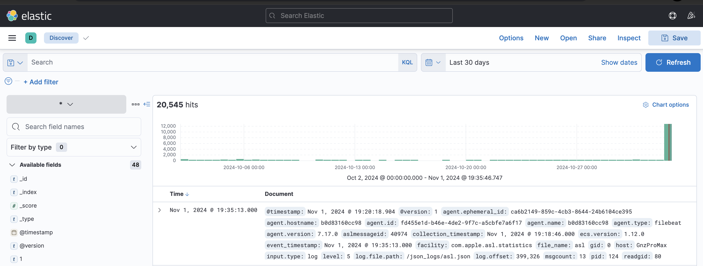

# iShinobu to ELK
`ishinobu2elk` loads logs collected by [iShinobu](https://github.com/gnzdotmx/ishinobu) into ELK. Logs have to be exported as JSON files.
The goal is to help security analysts to investigate and visualize data collected by iShinobu from a macOS system. This speeds up the triage and analysis of data during incident response.



# Installation
## Requirements
- Install Docker
- Install Docker compose
- Your favorite web browser

```
GOPRIVATE=github.com/gnzdotmx/ go install github.com/gnzdotmx/ishinobu2elk/ishinobu2elk@latest
```

# Usage
**Make sure you exported collected logs by iShinobu in JSON format.**
```bash
sudo ./ishinobu -m all -e json
```

## Load a single file.tar.gz
1. Specify the `file.tar.gz` generated by iShinobu.
	```bash
	ishinobu2elk load --file /path/file.tar.gz
	```
2. Access Kibana
 - Open your browser and navigate to http://localhost:5601.
 - Create an Index Pattern:
    - Navigate to `Management > Stack Management > Index Patterns`
    - Click on `Create index pattern`
	- Enter `*` as the index pattern.
	- Configure the time filter `event_timestamp`
	- Complete the creation process.
 - Explore Your Data:
	- Use Discover to view ingested logs.
	- Create Visualizations and Dashboards based on your data.
Note: Remember the path where you are located as you need to go back there when stopping or cleaning up resources.

## Load multiple file.tar.gz 
1. Place all files `logs.tar.gz` into a folder (Ex: `logs`)
2. Specify the folder which contains all the files
	```bash
	ishinobu2elk load --dir /path/logs
	``` 
3. Access Kibana
 - Open your browser and navigate to http://localhost:5601.
 - Create an Index Pattern:
    - Navigate to `Management > Stack Management > Index Patterns`
    - Click on `Create index pattern`
	- Enter `*` as the index pattern.
	- Configure the time filter `event_timestamp`
	- Complete the creation process.
 - Explore Your Data:
	- Use Discover to view ingested logs.
	- Create Visualizations and Dashboards based on your data.
Note: Remember the path where you are located as you need to go back there when stopping or cleaning up resources.

## Stop containers without removing logs
Go to the folder where `.resources` were created. (The path where you run `ishinobu2elk load`)
```bash
ishinobu2elk down
```

## Clean up resources
Go to the folder where `.resources` were created. (The path where you run `ishinobu2elk load`).

The following command stops containers, removes volumes and `.resources` folder.
```bash
ishinobu2elk clean
```